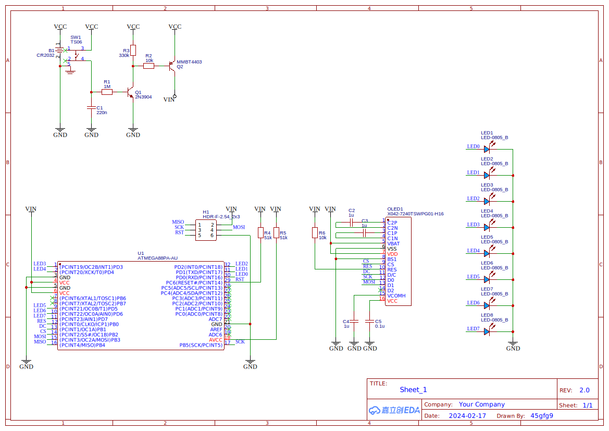

# [RollAByte](https://heap.45gfg9.net/rab-ex)

The same [*Roll a Byte*](https://heap.45gfg9.net/rants/809bc23b9ca6/), right in your hands this time.

This is a simple device to produce a random byte and show it on a 72x40 OLED display and 8 LEDs, based on the ATmega88PA and the amazing [U8g2](https://github.com/olikraus/u8g2) library.

## Build

This repository is a PlatformIO project. To build the project, clone this repository and open in PlatformIO IDE / build with PlatformIO CLI.

```bash
git clone --recurse-submodules https://github.com/45gfg9/RollAByte.git
cd RollAByte
pio run
```

## Hardware

The schematic, PCB layout and EasyEDA source are available in the `hardware` directory.




## License

This project is licensed under the WTFPL license. See the [LICENSE](LICENSE) file for details.
